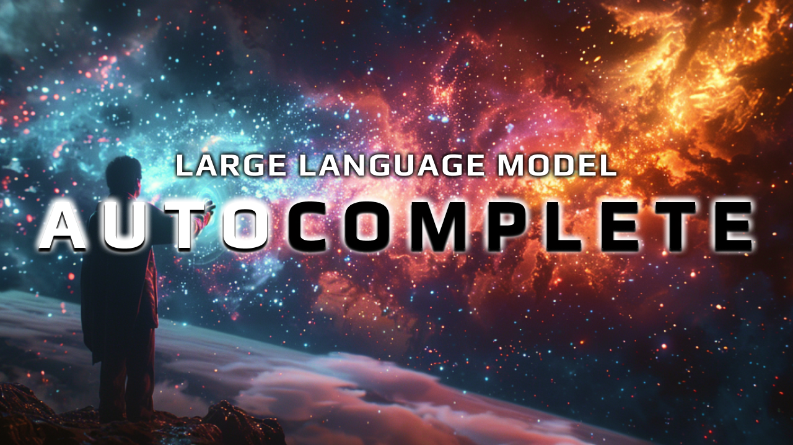

# LLM Autocomplete 🌐
> Exploring a valuable LLM use case: LLM Powered, Reusable, Domain Agnostic Autocompletes

## Why care about LLM powered autocompletes? 🤔
- **Time Efficiency**: Every second saved during user interaction enhances user satisfaction and directly boosts your earnings potential.
- **Reusability Across Domains**: These autocompletes can be seamlessly integrated into various tools and applications, regardless of the domain, making them incredibly versatile.
- **Adaptive Learning**: LLM autocompletes self-improve with each interaction, becoming more accurate and efficient over time.
- **Actionable Insights**: They provide valuable data about user preferences and needs, which can inform business strategies and product improvements.
- **Future-Proof**: Staying close to the evolving capabilities of LLMs means that any advancements in the technology will only enhance the functionality of your autocompletes.

## Setup 🛠️
### Frontend (Vue.js) 🖥️
- `yarn`
- `yarn dev`

### Backend (Python Flask) 🐍
- `cd server`
- `cp .env.sample .env` (to create server/.env)
- Fill in `.env`
- `python -m venv venv`
- `source venv/bin/activate` (Linux/Mac) or `venv\Scripts\activate` (Windows)
- `pip install -r requirements.txt`
- `python main.py`

### Prompt Testing (Promptfoo + Llama 3 + Groq) 🧪
- `cp .env.sample .env`
- Fill in `.env`
- `yarn`
- `yarn ptest`
- `yarn view`

### Callouts 📢
- There are two `.env` to setup. `.env` and `server/.env`.

## Resources 📚

- [Live Demo](https://youtu.be/28zuliyLd5Q)
- [Improve your prompt chains](https://youtu.be/QV6kaNFyoyQ)
- [Evaluate Your Prompts](https://youtu.be/sb9wSWeOPI4)
- [Promptfoo](https://promptfoo.dev/)
- [Groq](https://groq.com/)